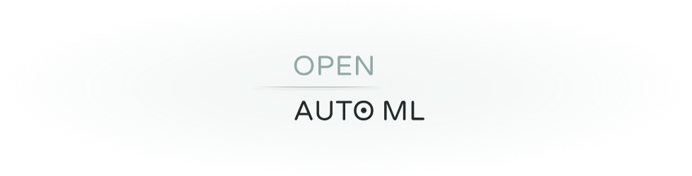

  <h1>Open AutoML</h1>
  
  
<em>Nice Description.</em>

  
  

## Authors

<!-- prettier-ignore -->
| [ <b>Sören Wegener</b>](https://twitter.com)| [ <b>Felix Haus</b>](http://twitter.com)| [ <b>Mike</b>](http://twitter.com)|
| :---: | :---: | :---: |

## License

This project is licensed under the MIT License - see [LICENSE.md](./LICENSE.md) for details.
