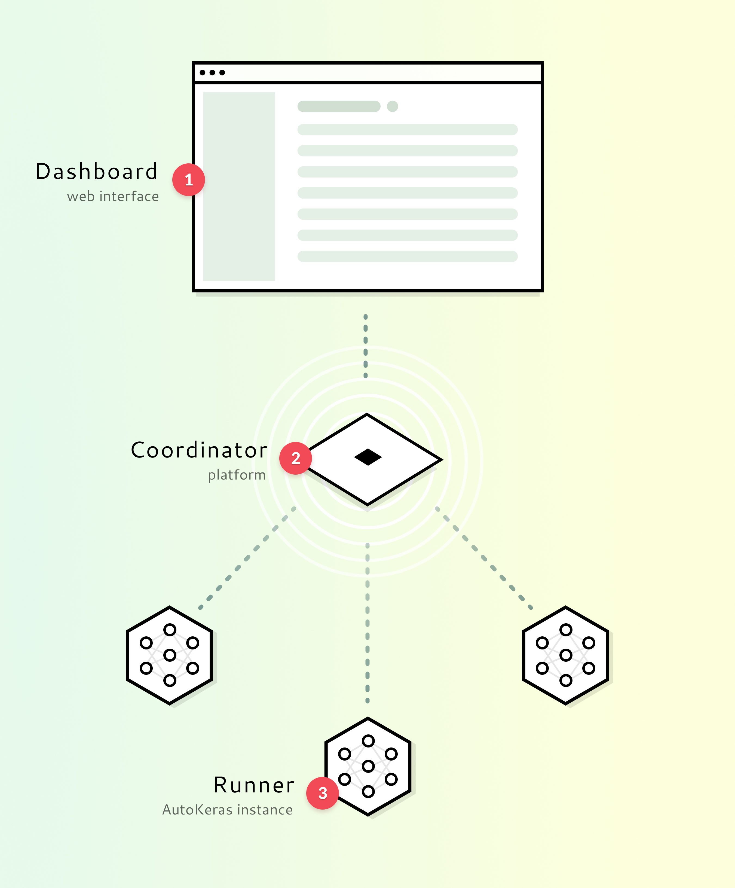

  
  <h1>MelonML</h1>

  
<em>An integrated and accessible platform for machine learning.</em>

  

## Introduction
MelonML has the vision to make machine learning more accessible by providing a simple and intuitive interface for training and testing neural networks.

## Architecture

  

### 1. Dashboard
The Dashboard is a React application. It provides the following features:

- Upload and manage your training data
- Schedule parameterized training tasks
- Get insights with reports from tasks
- Administrate users, organizations and runners

### 2. Coordinator
The Coordinator is a Django based application. It holds the data which can be uploaded via the UI and manages the runner instances. It is the backend for the Web UI and handles user management and access control.

It serves as storage for:

- Training data
- Trained models

### 3. Runner
Repository: https://github.com/MelonML/runner

The runner is responsible for the training of the machine learning model. It is beeing run by starting a docker container. After startup, it asks for the coordinator URL and a token to register itself to the coordinator.

It fetches the training data from the coordinator and uses [autokeras](https://github.com/jhfjhfj1/autokeras) to find a suitable model and train it. The final model is then pushed together with a report back to the coordinator.

## Milestones

## Authors

<!-- prettier-ignore -->
| [ <b>Sören Wegener</b>](https://github.com/soerface)| [ <b>Felix Haus</b>](https://github.com/ofhouse)| [ <b>Maik Jessulat</b>](https://github.com/m4j3)|
| :---: | :---: | :---: |

## License

This project is licensed under the MIT License - see [LICENSE.md](./LICENSE.md) for details.
